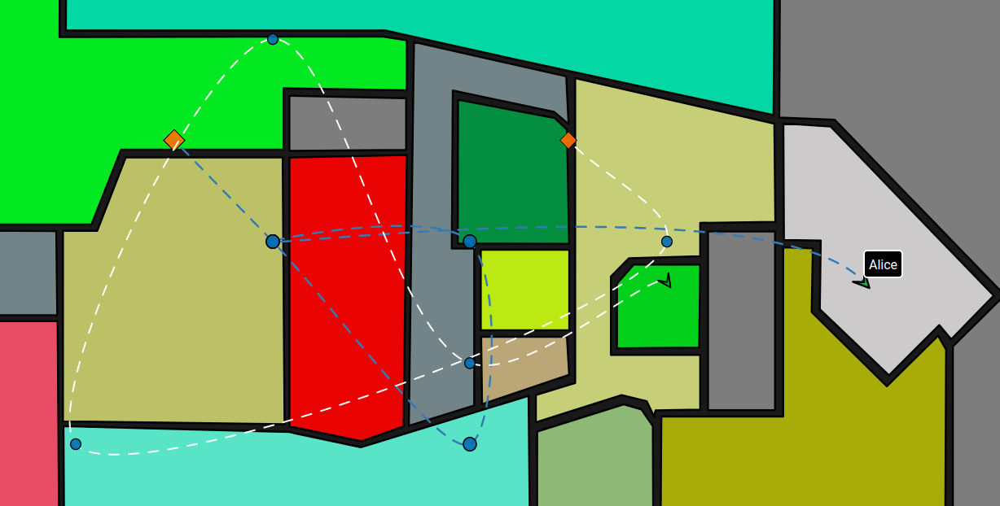

# GWP-Map

GWP-Map is an interactive visualisation for displaying spatio-temporal data such as indoor user tracking data.



The front-end is written using [React](https://reactjs.org) and [D3](https://d3js.org/). The REST API is powered by [Node](https://nodejs.org/en/), [Express](https://expressjs.com), and [Swagger](https://swagger.io/). The front-end is updated in real-time via [Socket IO](https://socket.io).

## Docs

- [Swagger REST API](http://gwp-map.herokuapp.com/swagger/)
- [Developer Instructions](client/README.md)

## Live Demo

1. Open the [map visualisation](http://gwp-map.herokuapp.com/) in a browser. Initially the map will be empty.
2. Open the [Swagger REST API](http://gwp-map.herokuapp.com/swagger/) in a separate browser window and expand the 
`​/api​/tracking​/adduser` documentation. You may interact with the REST API using the programming language of your choice, or try it out live in your browser by clicking the `Try it out` button.
3. Copy the following sample data into the request body, then execute the POST request:
```
{
    "id": 1231132123,
    "name": "socket user",
    "location": [
        {
            "x": 250,
            "y": 212,
            "timestamp": "2019-10-01T01:50:30.827Z"
        },
        {
            "x": 549,
            "y": 139,
            "timestamp": "2019-10-01T20:27:02.681Z"
        },
        {
            "x": 279,
            "y": 313,
            "timestamp": "2019-10-01T00:30:50.088Z"
        },
        {
            "x": 466,
            "y": 11,
            "timestamp": "2019-09-30T16:31:53.934Z"
        },
        {
            "x": 177,
            "y": 178,
            "timestamp": "2019-09-30T18:03:52.818Z"
        },
        {
            "x": 55,
            "y": 22,
            "timestamp": "2019-10-01T11:56:51.548Z"
        },
        {
            "x": 449,
            "y": 363,
            "timestamp": "2019-10-01T03:48:36.843Z"
        }
    ]
}
```
4. Go back to the map visualisation, and you will see that it has updated.
5. You can use `/api/tracking/adduserlocation` to continue adding new user locations and watch the map update in real-time, or use `/api/tracking/addusers` to add multiple users to track all at once.

## Known Issues

- You will need to add multiple locations before the map updates.
- The live demo is currently hosted on a free Heroku account, so may experience some downtime if overloaded. For serious use, please follow the developer instructions to set up your own visualisation instance.
